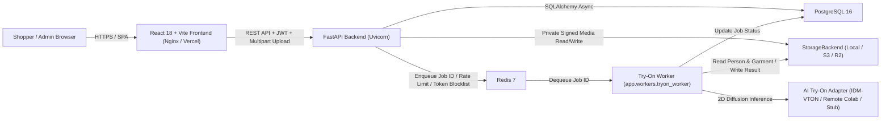
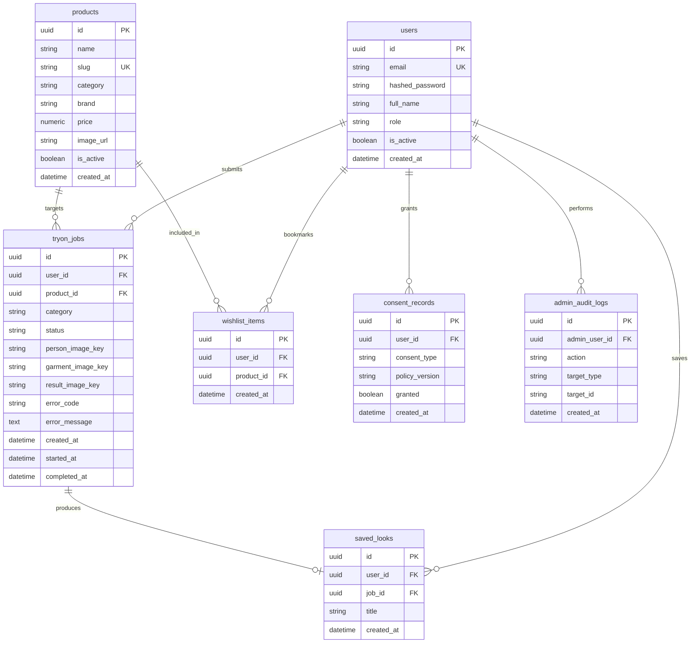
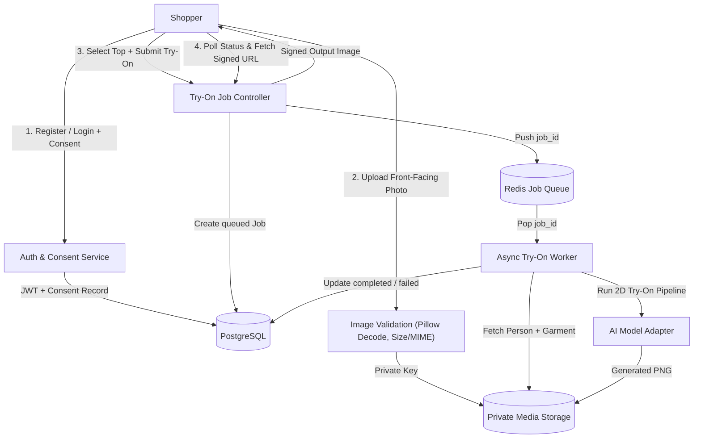

# VestiAI Architecture, Entity-Relationship & Data Flow Diagrams

## 1. High-Level System Architecture

```mermaid
flowchart LR
    User["Shopper / Admin Browser"] -->|"HTTPS / SPA"| Web["React 18 + Vite Frontend (Nginx / Vercel)"]
    Web -->|"REST API + JWT + Multipart Upload"| API["FastAPI Backend (Uvicorn)"]
    API -->|"SQLAlchemy Async"| DB["PostgreSQL 16"]
    API -->|"Enqueue Job ID / Rate Limit / Token Blocklist"| Redis["Redis 7"]
    API -->|"Private Signed Media Read/Write"| Storage["StorageBackend (Local / S3 / R2)"]
    Redis -->|"Dequeue Job ID"| Worker["Try-On Worker (app.workers.tryon_worker)"]
    Worker -->|"Read Person & Garment / Write Result"| Storage
    Worker -->|"Update Job Status"| DB
    Worker -->|"2D Diffusion Inference"| GPU["AI Try-On Adapter (IDM-VTON / Remote Colab / Stub)"]
```

---

## 2. Entity-Relationship (ER) Diagram

```mermaid
erDiagram
    users ||--o{ tryon_jobs : submits
    users ||--o{ saved_looks : saves
    users ||--o{ wishlist_items : bookmarks
    users ||--o{ consent_records : grants
    users ||--o{ admin_audit_logs : performs
    products ||--o{ tryon_jobs : targets
    products ||--o{ wishlist_items : included_in
    tryon_jobs ||--o| saved_looks : produces

    users {
        uuid id PK
        string email UK
        string hashed_password
        string full_name
        string role
        boolean is_active
        datetime created_at
    }

    products {
        uuid id PK
        string name
        string slug UK
        string category
        string brand
        numeric price
        string image_url
        boolean is_active
        datetime created_at
    }

    tryon_jobs {
        uuid id PK
        uuid user_id FK
        uuid product_id FK
        string category
        string status
        string person_image_key
        string garment_image_key
        string result_image_key
        string error_code
        text error_message
        datetime created_at
        datetime started_at
        datetime completed_at
    }

    saved_looks {
        uuid id PK
        uuid user_id FK
        uuid job_id FK
        string title
        datetime created_at
    }

    wishlist_items {
        uuid id PK
        uuid user_id FK
        uuid product_id FK
        datetime created_at
    }

    consent_records {
        uuid id PK
        uuid user_id FK
        string consent_type
        string policy_version
        boolean granted
        datetime created_at
    }

    admin_audit_logs {
        uuid id PK
        uuid admin_user_id FK
        string action
        string target_type
        string target_id
        datetime created_at
    }
```

---

## 3. Data Flow Diagram (DFD — Level 1)

```mermaid
flowchart TD
    Shopper["Shopper"] -->|"1. Register / Login + Consent"| Auth["Auth & Consent Service"]
    Auth -->|"JWT + Consent Record"| DB[("PostgreSQL")]
    Shopper -->|"2. Upload Front-Facing Photo"| Upload["Image Validation (Pillow Decode, Size/MIME)"]
    Upload -->|"Private Key"| Store[("Private Media Storage")]
    Shopper -->|"3. Select Top + Submit Try-On"| JobAPI["Try-On Job Controller"]
    JobAPI -->|"Create queued Job"| DB
    JobAPI -->|"Push job_id"| Queue[("Redis Job Queue")]
    Queue -->|"Pop job_id"| Worker["Async Try-On Worker"]
    Worker -->|"Fetch Person + Garment"| Store
    Worker -->|"Run 2D Try-On Pipeline"| AI["AI Model Adapter"]
    AI -->|"Generated PNG"| Store
    Worker -->|"Update completed / failed"| DB
    Shopper -->|"4. Poll Status & Fetch Signed URL"| JobAPI
    JobAPI -->|"Signed Output Image"| Shopper
```

